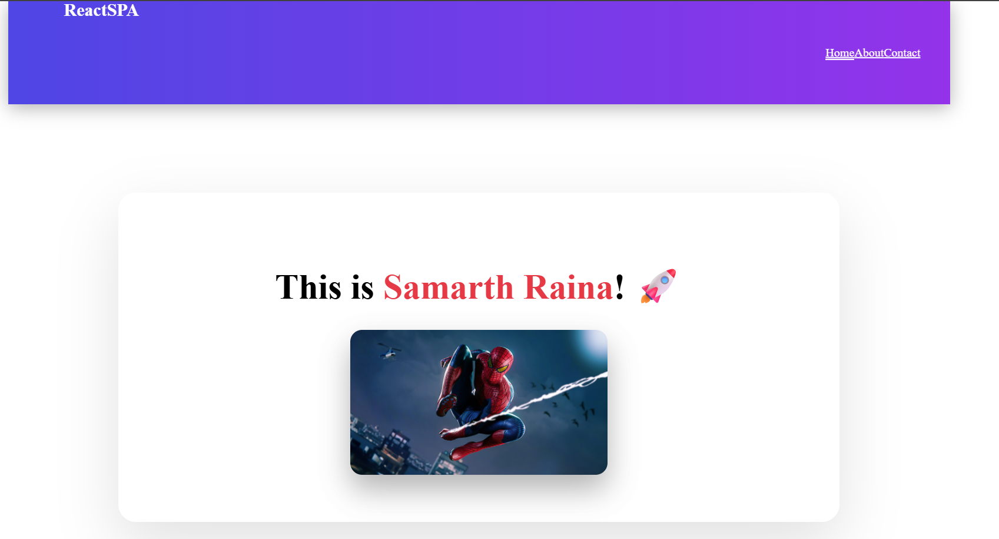

Experiment 3.1: Basic Client-Side Routing Using React Router
🎯 Aim
To implement basic client-side routing in a Single Page Application using React Router.

🛠️ Software Requirements
React
React Router DOM
Web Browser
📖 Theory
Routing in a Single Page Application allows navigation between different views without reloading the page.
React Router is a popular library used to handle client-side routing in React applications using components such as BrowserRouter, Routes, and Route.

🧪 Procedure
Create a React application.
Install react-router-dom package.
Wrap the application with BrowserRouter.
Define routes using Routes and Route components.
Navigate between pages without page reload.

