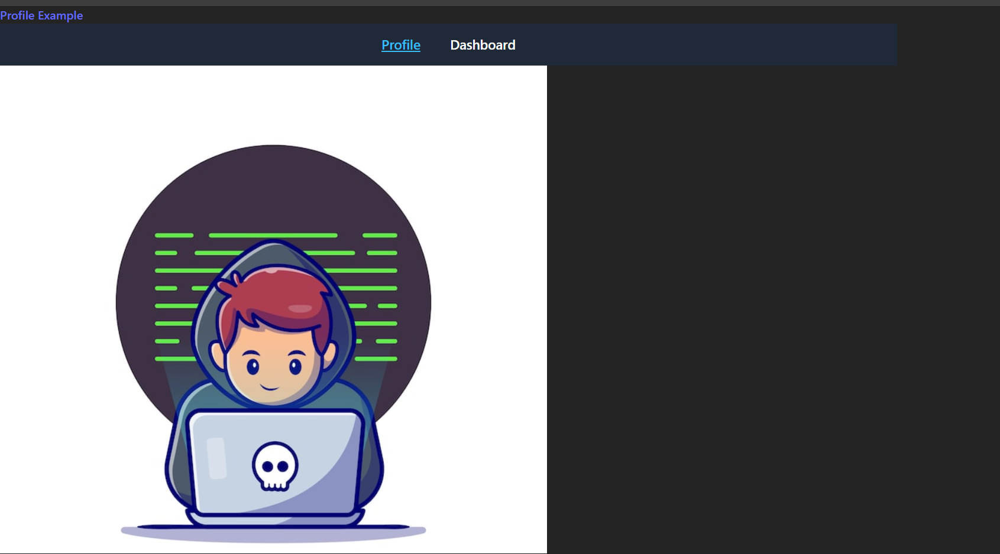

🚀 React SPA Routing with react-router-dom
This project demonstrates how to implement client-side routing in a Single Page Application (SPA) using React Router.

It includes:

Page routing using Routes and Route

Navigation using Link and NavLink

Active link styling

No page reloads (true SPA behavior)

📦 Technologies Used
React

react-router-dom (v6+)

JavaScript (ES6+)

CSS / Inline Styles

📂 Project Structure
text
Copy code
src/
├── components/
│ ├── Navbar.jsx
│ ├── Profile.jsx
│ └── Dashboard.jsx
├── App.jsx
└── main.jsx
🔧 Installation & Setup
bash
Copy code
npm install react-router-dom
npm start
🌐 BrowserRouter Setup
The app is wrapped inside BrowserRouter to enable routing.

jsx
Copy code
import { BrowserRouter } from "react-router-dom";

<BrowserRouter>
  <App />
</BrowserRouter>
🧭 Defining Routes
Routes determine which component is rendered for a given URL.

jsx
Copy code
import { Routes, Route } from "react-router-dom";

<Routes>
  <Route path="/" element={<Profile />} />
  <Route path="/dashboard" element={<Dashboard />} />
</Routes>
Route Behavior
URL	Rendered Component
/	Profile
/dashboard	Dashboard

🔗 Navigation Using Link
Link is used to navigate between pages without reloading the browser.

jsx
Copy code
import { Link } from "react-router-dom";

<Link to="/dashboard">Dashboard</Link>
Why not <a>?
<a> reloads the page

Link preserves app state and performance

🎯 Navigation Using NavLink
NavLink extends Link by detecting the active route, allowing dynamic styling.

jsx
Copy code
import { NavLink } from "react-router-dom";

<NavLink
to="/dashboard"
style={({ isActive }) => (isActive ? activeStyle : linkStyle)}

> Dashboard
> </NavLink>
> Benefits of NavLink
> Highlights active page

Ideal for navigation menus

Improves user experience

🎨 Active Link Styling
js
Copy code
const linkStyle = {
color: "white",
textDecoration: "none",
};

const activeStyle = {
color: "#38bdf8",
textDecoration: "underline",
};
🧠 How Routing Works in This App
User clicks a Link or NavLink

URL changes (e.g., /dashboard)

React Router matches the route

Corresponding component is rendered

No page refresh (SPA behavior)

⚖️ Link vs Routing (Quick Comparison)
Concept Purpose
Link / NavLink Changes the URL
Route Decides what component to render
Routes Matches the current URL

✅ Best Practices
Use Link instead of <a> for internal navigation

Use NavLink for menus and navbars

Define all routes inside a single Routes component

Keep routing logic centralized (usually in App.jsx)

📌 Summary
react-router-dom enables SPA navigation

Routing is client-side (no reloads)

Link navigates, Route renders

NavLink provides active state awareness

