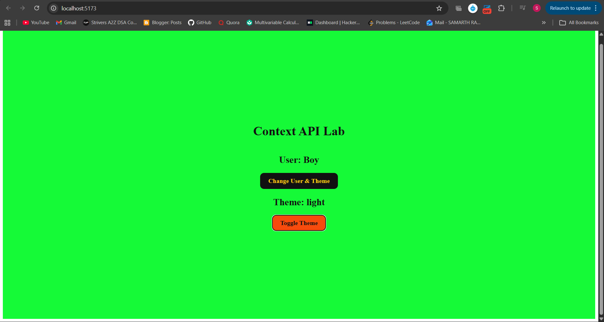
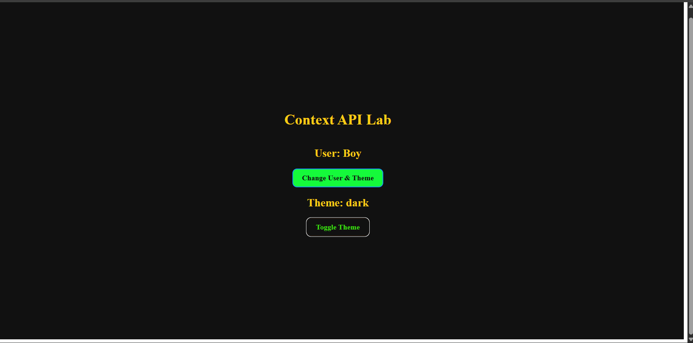

Context API & Redux Toolkit Lab

This project demonstrates state management in React using React Context API and Redux Toolkit.
It allows users to switch themes and update user information globally across the application.

🚀 Features

Global state management using Redux Toolkit

Theme switching (Light / Dark mode)

User state update functionality

Clean and interactive UI

Centralized store configuration

🎯 Objective

The objective of this lab is to understand:

How global state management works in React

How Redux Toolkit simplifies Redux setup

How to configure a store and create slices

How to connect React components with the Redux store

🛠 Technologies Used

React

Redux Toolkit

React Redux

JavaScript

HTML & CSS

📌 Functionality Overview

Displays current user information

Allows changing user and theme

Toggle button switches between light and dark themes

UI updates instantly using centralized state

📊 Learning Outcome

By completing this project, we learned:

How to configure Redux Toolkit store

How to create and manage slices

How to use useSelector and useDispatch

How global state improves scalability

