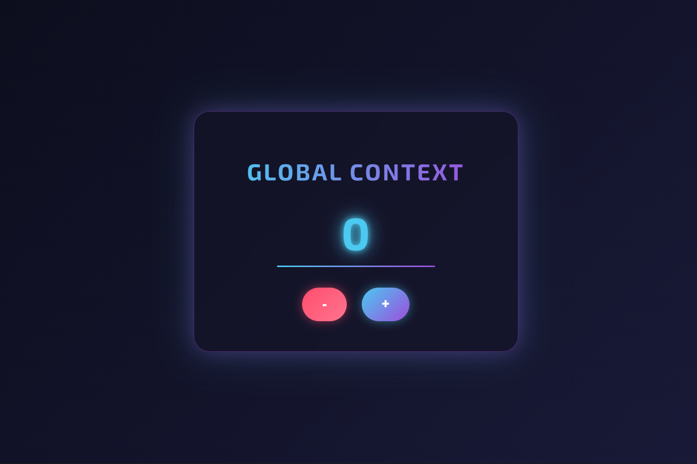
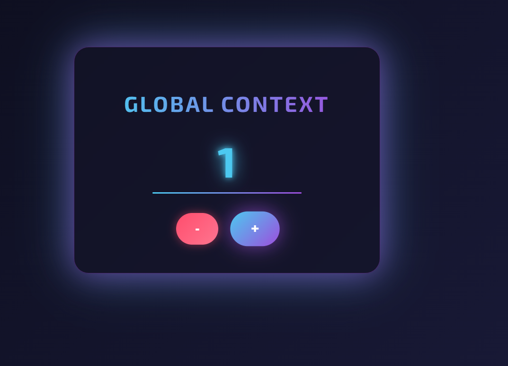

Global Context Counter App

This project demonstrates global state management in React using the Context API. It features a futuristic UI with a neon-inspired design and allows users to increment and decrement a counter using globally managed state.

📌 Project Overview

The application showcases:

Global state management using React Context API

Counter functionality (Increment & Decrement)

Centralized state shared across components

Modern futuristic UI design with glassmorphism and neon effects

The counter value is stored in a global context and accessed by components without prop drilling.

✨ Features

🌍 Global state using Context API

➕ Increment counter

➖ Decrement counter

🎨 Futuristic neon-themed UI

💡 Responsive and centered layout

🧊 Glassmorphism card effect

🧠 Concept Used: React Context API

The Context API allows data to be shared globally across components without passing props manually at every level.

Why Context API?

Avoids prop drilling

Simplifies state sharing

Keeps code organized

Improves scalability for medium-sized applications

🛠 Technologies Used

React

JavaScript

HTML5

CSS3 (Glassmorphism + Neon Effects)

Google Fonts

🎨 UI Design Highlights

Dark futuristic background

Glowing neon typography

Animated hover effects

Gradient-styled counter display

Modern button interactions

The interface focuses on a cyber-style aesthetic while maintaining clean usability.

🎯 Learning Outcomes

By completing this project, we learned:

How to create and use React Context

How to provide global state using Context Provider

How to consume context using hooks

How to manage shared state efficiently

How UI styling enhances user experience

