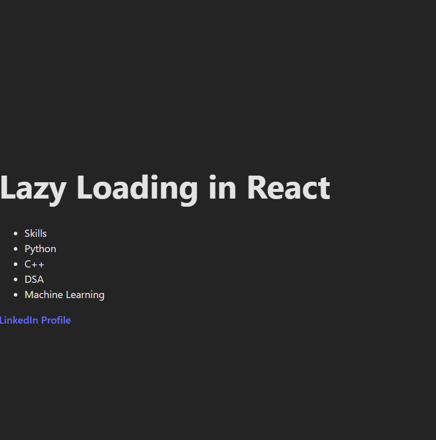

Lazy loading is an performance optimization technique where components are loaded only when they are required

In react React.lazy allows components to be loaded dynamically , in React React.suspense() provides a fallback UI when the component is loading.
Lazy loading increases the speed of application startup

