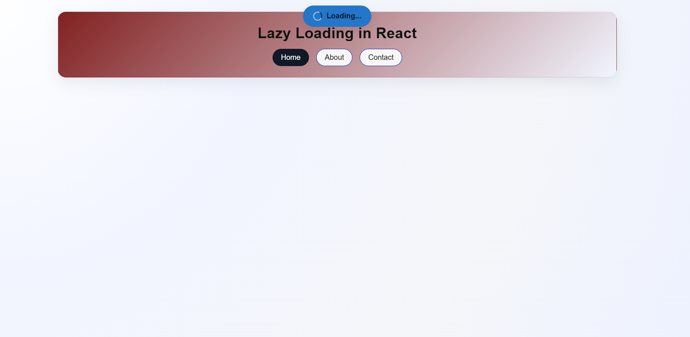
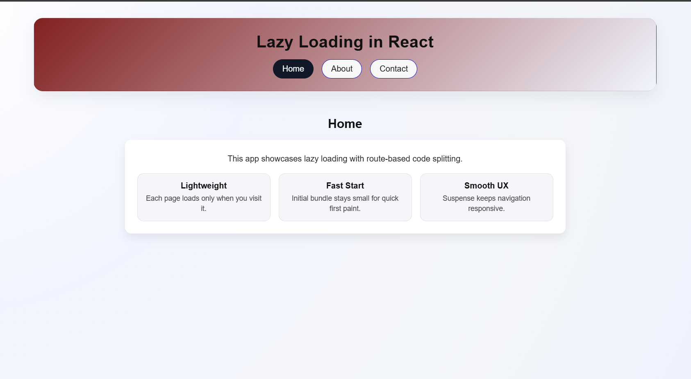
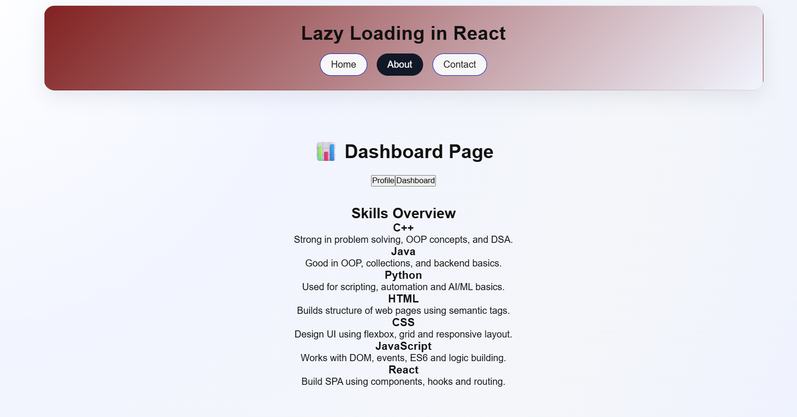
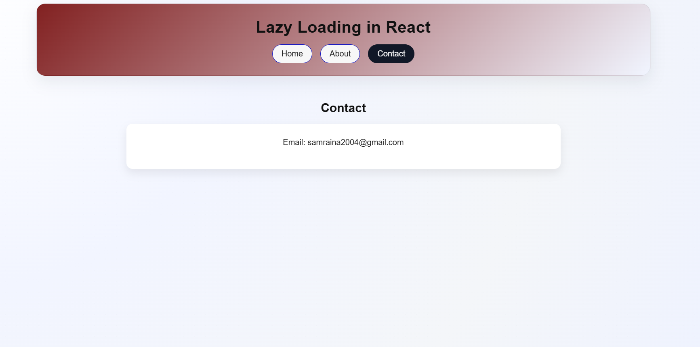

📘 Lazy Loading in React (Using React Router DOM)

This project demonstrates Lazy Loading in React using React Router DOM for route-based navigation and code splitting.

The application loads components only when the user visits a specific route, improving performance and reducing the initial bundle size.

🚀 Features

Route-based navigation (Home, About, Contact)

Lazy loading of components

Loading indicator while components are being fetched

Clean and responsive UI

Improved performance using code splitting

📄 Pages Included

Home – Overview of lazy loading and key benefits

About (Dashboard) – Skills and technology overview

Contact – Displays contact information

🎯 Objective

The main objective of this project is to understand:

How lazy loading works in React

How to use React Router DOM for routing

How to optimize application performance using code splitting

⚙️ Technologies Used

React

React Router DOM

JavaScript

HTML & CSS

📌 Conclusion

Lazy loading is an important optimization technique in modern React applications.
By loading components only when required, we achieve:

Faster initial load time

Better user experience

Improved application performance

