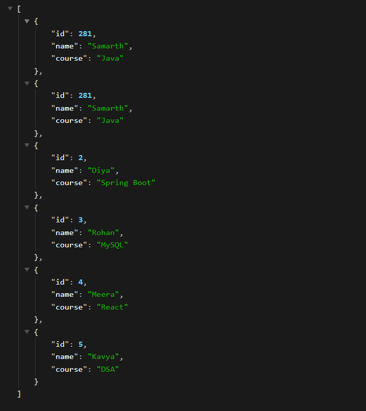
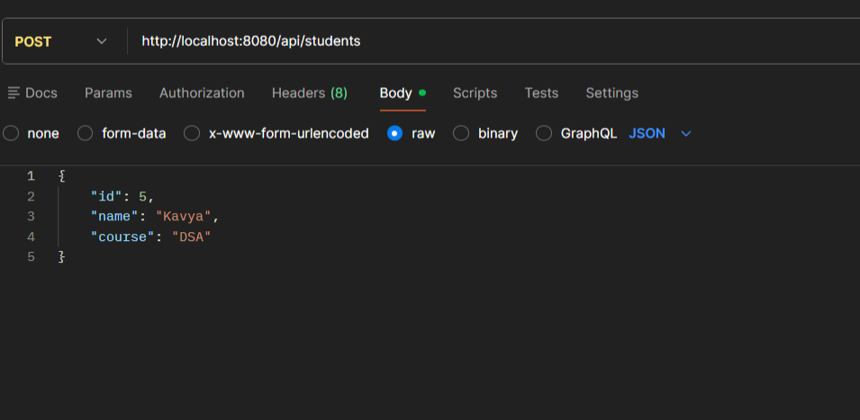

# Student REST API (Spring Boot)

## 📌 Description

This project is a REST API for managing student data using Spring Boot.
Users can add and retrieve student records dynamically.

---

## ⚙️ Features

* Add new student
* Get all students
* Get student by ID
* In-memory data storage

---

## 🛠️ Technologies Used

* Java
* Spring Boot
* REST API
* Maven

---

## 🚀 API Endpoints

### 🔹 Get All Students

```
GET /api/students
```

#### Response

```json
[
  {
    "id": 1,
    "name": "Aarav",
    "course": "Java"
  }
]
```

---

### 🔹 Add Student

```
POST /api/students
```

#### Request (JSON)

```json
{
  "id": 1,
  "name": "Samarth",
  "course": "AI"
}
```

---

### 🔹 Get Student by ID

```
GET /api/students/{id}
```

---

## 🧠 Working Flow

1. Client sends request
2. Controller handles API
3. Service processes logic
4. Data stored in memory (ArrayList)

---

## ⚠️ Note

* Data is **not persistent** (resets after server restart)
* Can be extended using database (JPA)

---

## ▶️ How to Run

1. Open project in Eclipse or VSCode
2. Run `RestApiApplication.java`
3. Test APIs using Postman or browser

---

## 🎓 Conclusion

This project demonstrates basic REST API development with dynamic data handling in Spring Boot.

