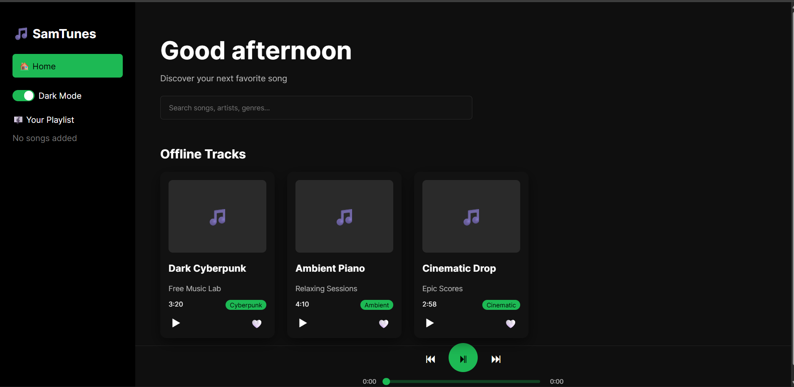

# SamTunes - Music Player

A modern, responsive music player web application built with **React** and **Vite**. Features a Spotify-inspired dark theme and dynamic user interactions.

## 🎵 Features

### 1. Dynamic Greeting

- The home screen greets you based on your local time:
  - "Good morning" (5 AM - 11 AM)
  - "Good afternoon" (12 PM - 4 PM)
  - "Good evening" (5 PM - 8 PM)
  - "Good night" (9 PM - 4 AM)
- Updates automatically every minute.

### 2. Advanced Music Player

- **Playback Controls**: Play, Pause, Previous, Next.
- **Seek Functionality**:
  - Interactive slider to scrub through the song.
- **Skip Controls**:
  - Rewind 10 seconds (⏮).
  - Fast-forward 10 seconds (⏭).
- **Time Display**: Shows current playback time and total duration.

### 3. "Your Playlist" Management

- **Add/Remove Songs**:
  - Click the Heart icon (🤍/❤️) on any song card to toggle it in your "Your Playlist".
- **Sidebar View**:
  - Selected songs appear instantly in the sidebar under "Your Playlist".
  - Shows empty state "No songs added" when clear.

### 4. Theme Customization

- **Dark Mode**: Toggle between Dark and Light themes using the switch in the Sidebar.
- **Visuals**: Features animated gradients and glassmorphism effects.

### 5. Offline Music

- Includes a set of pre-loaded offline tracks for immediate playback:
  - Dark Cyberpunk
  - Ambient Piano
  - Cinematic Drop

## 🚀 Technologies Used

- **Frontend**: React 18, Vite
- **Styling**: CSS Modules, Material UI (Slider component)
- **State Management**: React Hooks (`useState`, `useEffect`)
- **Audio**: Native HTML5 Audio API wrapper

## 📁 Project Structure

```
src/
├── components/
│   ├── MusicCard.jsx      # Song card with Play/Like controls
│   ├── Player.jsx         # Bottom player bar with seek/volume
│   └── Sidebar.jsx        # Navigation and Playlist sidebar
├── pages/
│   ├── Home.jsx           # Main dashboard with Dynamic Greeting
│   └── Library.jsx        # (In Progress) Extended library view
├── js/
│   └── audioPlayer.js     # Global audio controller singleton
├── App.jsx                # Main application layout
└── main.jsx               # Entry point
```

## 🎯 Getting Started

1. **Install Dependencies**

   ```bash
   npm install
   ```

2. **Run Development Server**

   ```bash
   npm run dev
   ```

3. **Open in Browser**
   - Typically http://localhost:5173

## � Future Roadmap

- [ ] Full Integration of Deezer API (Draft in `src/api/deezer.js`)



